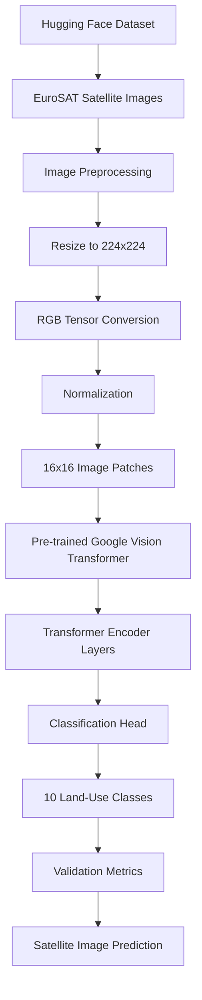

<div align="center">


<br/>

<a href="https://github.com/YOUR-USERNAME/satellite-vision-transformer">
  
</a>


</div>


##  Project Overview

**Satellite Vision Transformer** is a deep learning computer vision project focused on **land-use and land-cover classification from satellite imagery**.

The project uses a pre-trained **Google Vision Transformer (ViT)** and applies **Transfer Learning** to the EuroSAT dataset. Instead of relying on a traditional Convolutional Neural Network (CNN), the model uses Transformer-based self-attention to learn visual patterns from satellite images.

The trained model achieved approximately **98.05% validation accuracy after only 1 epoch**, demonstrating the effectiveness of transfer learning for remote-sensing image classification.

###  Key Highlights

*  Satellite image classification
*  Vision Transformer (ViT) architecture
*  Transfer learning from a pre-trained Google ViT
*  Hugging Face Transformers ecosystem
*  PyTorch-based training
*  Approximately **98.05% validation accuracy**
*  GPU-accelerated training on Kaggle
*  10 EuroSAT land-use classes
*  Computer Vision + Remote Sensing

##  Primary Objectives

The main objectives of this project are:

* Implement a modern **Vision Transformer** architecture for computer vision.
* Apply transfer learning to satellite imagery.
* Use the Hugging Face ecosystem for dataset processing and model training.
* Build an efficient image preprocessing pipeline.
* Convert raw image data into model-ready tensors.
* Fine-tune a pre-trained Transformer model for a 10-class classification task.
* Evaluate model performance using validation accuracy and loss.
* Demonstrate practical applications of deep learning in remote sensing.

## 🛰️ Dataset

This project uses the **EuroSAT dataset**, a benchmark dataset for land-use and land-cover classification using satellite imagery.

The dataset contains satellite images representing different geographical and land-use categories.

### Dataset Classes

The model classifies images into the following 10 categories:

| Class                | Description                         |
| -------------------- | ----------------------------------- |
| AnnualCrop           | Agricultural land with annual crops |
| Forest               | Forested areas                      |
| HerbaceousVegetation | Herbaceous vegetation               |
| Highway              | Roads and highways                  |
| Industrial           | Industrial areas                    |
| Pasture              | Pasture and grazing land            |
| PermanentCrop        | Permanent agricultural crops        |
| Residential          | Residential areas                   |
| River                | Rivers and waterways                |
| SeaLake              | Seas and lakes                      |

### Dataset Characteristics

* **Dataset:** EuroSAT
* **Image Type:** Satellite imagery
* **Number of Classes:** 10
* **Input Resolution:** 224 × 224 pixels
* **Task:** Multi-class image classification

## 🏗️ System Architecture



## 🗂️ Repository Structure

```text
satellite-vision-transformer/
│
├── notebooks/
│   └── eurosat-vit-classifier.ipynb
│
├── README.md
│
└── .gitignore
```

### File Description

| File                                     | Description                                              |
| ---------------------------------------- | -------------------------------------------------------- |
| `notebooks/eurosat-vit-classifier.ipynb` | Complete Kaggle/Jupyter training and evaluation notebook |
| `README.md`                              | Project documentation                                    |
| `.gitignore`                             | Files and folders excluded from Git                      |
## 🛠️ Data Pipeline & Preprocessing

The raw satellite images cannot be directly passed into the Vision Transformer. They first need to be transformed into the mathematical representation expected by the model.

### 1. Dataset Loading

The EuroSAT dataset is loaded from the Hugging Face ecosystem.

```text
Hugging Face Hub
       ↓
EuroSAT Dataset
       ↓
Satellite Images
```

### 2. Image Resizing

Each image is resized to:

```text
224 × 224 pixels
```

This matches the input resolution expected by the pre-trained ViT model.

### 3. RGB Conversion

Satellite images are converted into RGB representations suitable for the model.

### 4. Tensor Conversion

The images are converted into PyTorch tensors.

The resulting tensor has the approximate structure:

```text
[3, 224, 224]
```

where:

* `3` = RGB channels
* `224` = image height
* `224` = image width

### 5. Normalization

Pixel values are normalized using the preprocessing configuration associated with the pre-trained Vision Transformer.

### 6. Patch Embedding

The Vision Transformer divides the image into smaller patches.

For a 224 × 224 image with 16 × 16 patches:

```text
224 / 16 = 14
```

Therefore:

```text
14 × 14 = 196 image patches
```

These patches are transformed into embeddings and passed through the Transformer encoder.

##  Model Architecture

The project uses the pre-trained Google Vision Transformer:

```text
google/vit-base-patch16-224-in21k
```

The model was originally pre-trained on a large image dataset and then fine-tuned for the EuroSAT classification task.

### Model Pipeline

```text
Satellite Image
      ↓
Image Processor
      ↓
224 × 224 RGB Tensor
      ↓
16 × 16 Image Patches
      ↓
Patch Embeddings
      ↓
Vision Transformer Encoder
      ↓
Classification Head
      ↓
10 Land-Use Classes
```

### Why Vision Transformer?

Traditional CNN architectures process images primarily through convolutional filters.

Vision Transformers instead divide images into patches and use **self-attention** to learn relationships between different regions of an image.

This makes the architecture particularly interesting for satellite imagery, where distant regions of an image can contain useful contextual information.

## 📊 Model Performance & Metrics

The model was evaluated on an unseen validation split.

### Results

| Metric                  |         Result |
| ----------------------- | -------------: |
| **Validation Accuracy** |     **98.05%** |
| Training Epochs         |          **1** |
| Training Loss           |      **~0.59** |
| Architecture            |   **ViT-Base** |
| Number of Classes       |         **10** |
| Input Resolution        |  **224 × 224** |
| Patch Size              |    **16 × 16** |
| Hidden Size             |        **768** |
| Transformer Layers      |         **12** |
| Hardware                | **Kaggle GPU** |

### 📈 Validation Accuracy

```text
Validation Accuracy
        98.05%
          ██████████████████████████████████████████████████
```

The strong validation performance demonstrates the effectiveness of using a pre-trained Vision Transformer for satellite image classification.

> **Note:** Reported metrics are based on the experiment recorded in the included notebook. Results may vary depending on dataset splits, preprocessing, random seeds, hardware, and training configuration.
##  Technologies Used

### Programming Language

* Python 3.10+

### Deep Learning

* PyTorch
* TorchVision
* Hugging Face Transformers

### Dataset & Evaluation

* Hugging Face Datasets
* Hugging Face Evaluate
* EuroSAT

### Development Environment

* Kaggle Notebook
* Jupyter Notebook
* GPU acceleration

### Core Concepts

* Computer Vision
* Transfer Learning
* Vision Transformers
* Image Classification
* Remote Sensing
* Deep Learning
* GPU Training
##  Getting Started

### Prerequisites

Make sure you have:

* Python 3.10+
* Git
* Jupyter Notebook
* A CUDA-enabled GPU is recommended for training

### 1. Clone the Repository

Replace `YOUR-USERNAME` with your GitHub username.

```bash
git clone https://github.com/YOUR-USERNAME/satellite-vision-transformer.git
cd satellite-vision-transformer
```

---

### 2. Install Dependencies

```bash
pip install torch torchvision transformers datasets evaluate matplotlib
```

---

### 3. Launch Jupyter Notebook

```bash
jupyter notebook
```

Then open:

```text
notebooks/eurosat-vit-classifier.ipynb
```
## 💻 Running on Kaggle

The project was designed to work well in a GPU-enabled Kaggle environment.

Recommended setup:

```text
Notebook Environment
        ↓
Enable GPU
        ↓
Load EuroSAT Dataset
        ↓
Preprocess Images
        ↓
Load Pre-trained ViT
        ↓
Fine-tune Model
        ↓
Evaluate Accuracy
        ↓
Run Predictions
```
For faster training, enable a Kaggle GPU accelerator before executing the training cells.
---

##  Example Prediction

After training, the model can be used to classify previously unseen satellite imagery.

Conceptually:

```text
Input Satellite Image
        ↓
Image Processor
        ↓
Vision Transformer
        ↓
Classification Probabilities
        ↓
Predicted Land-Use Category
```

Example:

```text
Input:
Satellite Image

Prediction:
Forest

Confidence:
98.7%
```
The exact prediction and confidence depend on the image provided to the trained model.


##  Project Highlights

### 🔹 Transfer Learning

Instead of training a Vision Transformer from scratch, this project starts with a powerful pre-trained model and adapts it to satellite imagery.

### 🔹 Transformer-Based Computer Vision

The project demonstrates how Transformer architectures can be applied beyond Natural Language Processing.

### 🔹 Remote Sensing

Satellite imagery provides an excellent real-world application for computer vision and deep learning.

### 🔹 Efficient Fine-Tuning

The model achieved approximately **98.05% validation accuracy after 1 epoch** in the recorded experiment.

### 🔹 Modern AI Stack

The project combines:

```text
PyTorch
+
Hugging Face
+
Vision Transformers
+
EuroSAT
+
GPU Computing
```

## 🔬 Possible Future Improvements

Several improvements could be explored in future versions:

* Train for additional epochs.
* Perform systematic hyperparameter tuning.
* Add data augmentation.
* Compare ViT against CNN architectures such as ResNet and EfficientNet.
* Generate a confusion matrix.
* Calculate precision, recall, and F1-score for every class.
* Add Grad-CAM or attention visualization.
* Experiment with different Vision Transformer architectures.
* Export the trained model for deployment.
* Build a Streamlit or Gradio inference application.
* Create an API for real-time satellite image classification.
* Deploy the model to a cloud inference service.

##  Potential Applications

A satellite image classification system like this can support applications such as:

*  Forest monitoring
*  Agricultural analysis
*  Urban planning
*  Infrastructure monitoring
*  Water-body detection
*  Remote sensing
*  Environmental monitoring
*  Land-use analysis
*  Industrial-area identification


##  What This Project Demonstrates

This project demonstrates practical experience with:

```text
Dataset Engineering
        ↓
Image Preprocessing
        ↓
Tensor Transformation
        ↓
Transfer Learning
        ↓
Vision Transformers
        ↓
GPU Training
        ↓
Model Evaluation
        ↓
Computer Vision Inference
```

It also demonstrates the ability to work with modern machine-learning tooling and apply pre-trained models to a specialized real-world domain.

## ⭐ GitHub Topics

Recommended repository topics:

```text
computer-vision
deep-learning
pytorch
huggingface
vision-transformer
transformers
eurosat
satellite-imagery
remote-sensing
image-classification
transfer-learning
machine-learning
```

## 👨‍💻 Author
Addin-alt
Interested in:

* Machine Learning
* Deep Learning
* Computer Vision
* Generative AI
* Transformers
* Data Science
* AI Engineering

## ⭐ If You Found This Project Interesting

Feel free to ⭐ star the repository and explore the notebook to see the complete training pipeline.

<div align="center">

### 🛰️ Satellite Vision Transformer

**Computer Vision • Transfer Learning • Transformers • Remote Sensing**

</div>
