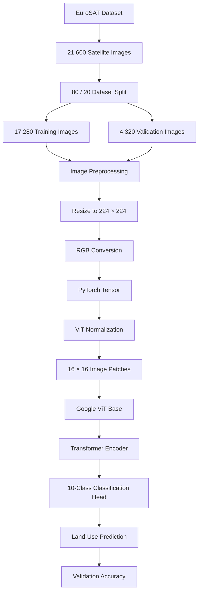

<div align="center">


<br/>

<a href="https://github.com/YOUR-USERNAME/satellite-vision-transformer">
  
</a>


</div>

---

## ✨ Project Overview

**Satellite Vision Transformer** is a deep learning computer vision project for **land-use and land-cover classification from satellite imagery**.

The project fine-tunes Google's pretrained **Vision Transformer (ViT)** on the **EuroSAT** satellite image dataset using **PyTorch** and the **Hugging Face Transformers** ecosystem.

Instead of using a traditional convolutional neural network, the model divides satellite images into fixed-size patches and processes them using Transformer-based self-attention.

In the recorded Kaggle experiment, the model was trained for only **1 epoch** and achieved:

<div align="center">


</div>

---

## 🎯 Primary Objectives

The main objectives of this project are to:

* Apply **Vision Transformers** to satellite image classification
* Fine-tune a pretrained ViT using transfer learning
* Classify satellite imagery into 10 land-use categories
* Build a complete preprocessing pipeline for remote-sensing images
* Use Hugging Face Datasets and Transformers for model development
* Train efficiently using GPU acceleration
* Evaluate classification performance on a held-out validation set
* Demonstrate a practical application of Transformers beyond natural language processing

---

## 🛰️ Dataset

The project uses the **EuroSAT** dataset loaded directly through the Hugging Face Datasets library:

```python
dataset = load_dataset("tanganke/eurosat", split="train")
```

The experiment loaded:

| Dataset Property         |         Value |
| ------------------------ | ------------: |
| Total Images             |    **21,600** |
| Training Images          |    **17,280** |
| Validation Images        |     **4,320** |
| Number of Classes        |        **10** |
| Train / Validation Split | **80% / 20%** |
| Random Seed              |        **42** |
| Input Resolution         | **224 × 224** |

### Land-Use Classes

The dataset used in the notebook contains the following classes:

| ID | Class                                        |
| -: | -------------------------------------------- |
|  0 | Annual crop land                             |
|  1 | Forest                                       |
|  2 | Brushland or shrubland                       |
|  3 | Highway or road                              |
|  4 | Industrial buildings or commercial buildings |
|  5 | Pasture land                                 |
|  6 | Permanent crop land                          |
|  7 | Residential buildings, homes, or apartments  |
|  8 | River                                        |
|  9 | Lake or sea                                  |

These categories represent different types of land cover visible in satellite imagery.

---

## 🏗️ System Architecture



---

## 🧠 Vision Transformer Model

The project uses the pretrained model:

```text
google/vit-base-patch16-224-in21k
```

This is a **ViT-Base** architecture pretrained on ImageNet-21k.

The model expects images with a resolution of:

```text
224 × 224 × 3
```

Each image is divided into **16 × 16 patches**.

For a 224 × 224 image:

```text
224 / 16 = 14
```

This creates:

```text
14 × 14 = 196 image patches
```

Conceptually:

```text
Satellite Image
       ↓
224 × 224 RGB Image
       ↓
16 × 16 Patches
       ↓
196 Patch Tokens
       ↓
Patch Embeddings
       ↓
Transformer Encoder
       ↓
Image Representation
       ↓
10-Class Classification Head
       ↓
Land-Use Prediction
```

---

## 🔄 Transfer Learning

Training a Vision Transformer entirely from scratch would require a much larger dataset and substantially more computational resources.

This project instead uses **transfer learning**.

The pretrained ViT already contains visual representations learned from a large image collection. The existing model is loaded and its classification layer is adapted for the 10 EuroSAT classes.

During initialization, Hugging Face reports that the original classifier weights are missing for this new task:

```text
classifier.bias   | MISSING
classifier.weight | MISSING
```

This is expected because a new classification head is created for the **10 EuroSAT categories** and learned during fine-tuning.

---

## 🛠️ Image Preprocessing

The raw satellite images are transformed before being passed to the Transformer.

### Processing Pipeline

```text
Raw Satellite Image
        ↓
Convert to RGB
        ↓
Resize to 224 × 224
        ↓
Convert to PyTorch Tensor
        ↓
Normalize Pixel Values
        ↓
Model-Ready Tensor
```

The resulting tensor shape is:

```text
torch.Size([3, 224, 224])
```

Where:

```text
3   = RGB channels
224 = image height
224 = image width
```

Normalization uses the mean and standard deviation associated with the pretrained ViT image processor.

---

## ⚙️ Training Configuration

The model was fine-tuned using Hugging Face's `Trainer` API.

| Parameter                   | Configuration                       |
| --------------------------- | ----------------------------------- |
| Model                       | `google/vit-base-patch16-224-in21k` |
| Epochs                      | **1**                               |
| Learning Rate               | **5e-5**                            |
| Per-Device Training Batch   | **16**                              |
| Gradient Accumulation       | **2 steps**                         |
| Per-Device Evaluation Batch | **16**                              |
| Evaluation Strategy         | Every epoch                         |
| Save Strategy               | Every epoch                         |
| Best Model Metric           | Accuracy                            |
| Training Images             | **17,280**                          |
| Validation Images           | **4,320**                           |
| GPU Environment             | **Tesla T4 × 2**                    |

With two GPUs visible during the Kaggle run, the training setup produced **270 optimization steps** for the single epoch.

---

## 📊 Model Performance

The model achieved strong validation performance after only one epoch of fine-tuning.

### Final Recorded Results

| Metric                      |             Result |
| --------------------------- | -----------------: |
| **Validation Accuracy**     |       **0.981481** |
| **Validation Accuracy (%)** |       **98.1481%** |
| Validation Loss             |       **0.253656** |
| Logged Training Loss        |       **0.267159** |
| Epochs                      |              **1** |
| Global Training Steps       |            **270** |
| Training Runtime            | **375.82 seconds** |
| Training Samples / Second   |         **45.979** |

<div align="center">

### Validation Accuracy

```text
98.15%

█████████████████████████████████████████████████░
```

</div>

The result shows that a pretrained Vision Transformer can adapt effectively to satellite land-use classification with relatively little fine-tuning.

> **Important:** The reported **98.15% accuracy is validation accuracy** from the held-out 20% split. The current notebook does not evaluate a separate independent test set.

---

## 🖥️ Training Environment

The recorded Kaggle run used:

```text
Platform:
Kaggle Notebook

Accelerator:
GPU T4 × 2

Dataset Images:
21,600

Training Images:
17,280

Validation Images:
4,320

Training Epochs:
1

Training Runtime:
~6.26 minutes

Complete Notebook Runtime:
~7.47 minutes
```

GPU acceleration makes fine-tuning the Vision Transformer substantially faster than CPU-based training.

---

## 🛠️ Technology Stack

<div align="center">


</div>

| Area                 | Technology                |
| -------------------- | ------------------------- |
| Programming Language | Python                    |
| Deep Learning        | PyTorch                   |
| Model Framework      | Hugging Face Transformers |
| Dataset Library      | Hugging Face Datasets     |
| Evaluation           | Hugging Face Evaluate     |
| Image Processing     | TorchVision               |
| Numerical Computing  | NumPy                     |
| Visualization        | Matplotlib                |
| Training Environment | Kaggle                    |
| Hardware             | NVIDIA Tesla T4 × 2       |

---

## 🗂️ Repository Structure

A simple repository structure for the current project is:

```text
satellite-vision-transformer/
│
├── notebooks/
│   └── eurosat-vit-classifier.ipynb
│
├── README.md
├── requirements.txt
└── .gitignore
```

| File                           | Description                                                             |
| ------------------------------ | ----------------------------------------------------------------------- |
| `eurosat-vit-classifier.ipynb` | Complete data loading, preprocessing, training, and evaluation notebook |
| `README.md`                    | Project documentation                                                   |
| `requirements.txt`             | Python dependencies                                                     |
| `.gitignore`                   | Files excluded from version control                                     |

---

## ⚙️ Getting Started

### Clone the Repository

```bash
git clone https://github.com/YOUR-USERNAME/satellite-vision-transformer.git
cd satellite-vision-transformer
```

### Install Dependencies

```bash
pip install torch torchvision transformers datasets evaluate matplotlib numpy pandas
```

### Launch Jupyter

```bash
jupyter notebook
```

Open:

```text
notebooks/eurosat-vit-classifier.ipynb
```

---

## ☁️ Running on Kaggle

This project was developed in a Kaggle Notebook.

Recommended workflow:

```text
Create Kaggle Notebook
        ↓
Enable GPU Accelerator
        ↓
Install Transformers Libraries
        ↓
Download EuroSAT from Hugging Face
        ↓
Create 80 / 20 Split
        ↓
Preprocess Images
        ↓
Load Pretrained ViT
        ↓
Fine-Tune for 1 Epoch
        ↓
Evaluate Validation Accuracy
```

Required packages can be installed inside Kaggle with:

```python
!pip install -q transformers datasets evaluate
```

---

## 🔍 Model Workflow

The complete project pipeline can be summarized as:

```text
EuroSAT
   ↓
21,600 Images
   ↓
80 / 20 Split
   ↓
17,280 Train + 4,320 Validation
   ↓
224 × 224 Preprocessing
   ↓
Pretrained Google ViT
   ↓
Transfer Learning
   ↓
10-Class Classification
   ↓
Validation Evaluation
   ↓
98.15% Accuracy
```

---

## 🌍 Potential Applications

Satellite image classification can support areas such as:

* 🌲 Forest and vegetation monitoring
* 🌾 Agricultural land analysis
* 🏙️ Urban development monitoring
* 🛣️ Infrastructure identification
* 🏭 Industrial-area detection
* 🌊 Water-body classification
* 🛰️ Remote sensing research
* 🌎 Environmental monitoring
* 🗺️ Land-use and land-cover mapping

The current project is an experimental image classifier and is not designed as a production geospatial decision system.

---

## 🔬 Future Improvements

The current experiment provides a strong baseline, but several improvements could make the project more complete:

* Train for additional epochs
* Add data augmentation
* Introduce a separate test set
* Generate a confusion matrix
* Calculate per-class precision, recall, and F1-score
* Compare ViT with ResNet and EfficientNet
* Compare multiple Transformer architectures
* Add learning-rate scheduling
* Perform hyperparameter tuning
* Visualize Transformer attention
* Analyze misclassified satellite images
* Export the trained model
* Add a single-image prediction interface
* Build a Streamlit or Gradio application
* Deploy the classifier through an API

---

## ⚠️ Current Limitations

The recorded experiment evaluates performance using a **single 80/20 train-validation split** and only **one training epoch**.

Important limitations include:

* No independent test split is evaluated
* Accuracy is the primary reported metric
* No per-class precision, recall, or F1-score is currently reported
* No confusion matrix is generated
* No systematic hyperparameter search was performed
* The experiment does not compare ViT with other architectures
* Performance on satellite data outside the loaded EuroSAT dataset has not been evaluated

For these reasons, the reported **98.15% validation accuracy** should be interpreted as the performance of this specific experimental configuration.

---

## ⭐ GitHub Topics

Recommended topics:

```text
computer-vision
deep-learning
pytorch
huggingface
vision-transformer
transformers
eurosat
satellite-imagery
remote-sensing
image-classification
transfer-learning
machine-learning
```

---

## 👨‍💻 Author

<div align="center">

### Developed by **Addin Alt**

<a href="https://github.com/addin-alt">
  
</a>

</div>

Interested in:

* Machine Learning
* Deep Learning
* Computer Vision
* Vision Transformers
* Generative AI
* Data Science
* AI Engineering

---

## ⭐ Support

If you find this project useful or interesting, consider giving the repository a star.

<div align="center">

### 🛰️ Satellite Vision Transformer

**Satellite Imagery • Vision Transformers • Transfer Learning • Remote Sensing**

<br/>


</div>
